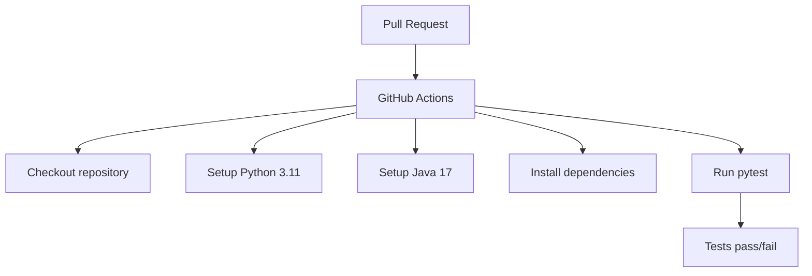

# PySpark CI with GitHub Actions

A simple PySpark data-processing project demonstrating **unit testing with pytest** and **Continuous Integration (CI) with GitHub Actions**.

The project implements a `clean_data()` function that cleans input data and calculates a tax-inclusive amount. Every Pull Request automatically runs the PySpark unit tests through GitHub Actions.

## Technologies

* **Python**
* **Apache PySpark**
* **pytest**
* **GitHub Actions**
* **Java**

## Requirements

* Python 3.11+
* Java 17
* PySpark 3.5.6
* pytest 8.4.2

## Functionality

The `clean_data()` function performs the following operations:

1. Removes rows where `amount <= 0`.
2. Removes rows where `name` is `NULL`.
3. Adds an `amount_with_tax` column.
4. Calculates the tax-inclusive amount as:

```text
amount_with_tax = amount × 1.20
```

## Testing

The project uses `pytest` for unit testing.

The tests verify that:

* Valid records are kept.
* Records with `amount <= 0` are removed.
* Records with `NULL` names are removed.
* `amount_with_tax` is calculated correctly.

### Install dependencies

```bash
pip install -r requirements.txt
```

### Run the tests

```bash
pytest -v
```

Expected result:

```text
4 passed
```

## Continuous Integration

GitHub Actions automatically runs the test suite whenever a Pull Request is:

* Opened
* Updated with new commits
* Reopened

## CI Workflow



If all tests pass, the Pull Request receives a successful CI check. If a test fails, the CI check fails and the issue can be fixed before merging.
